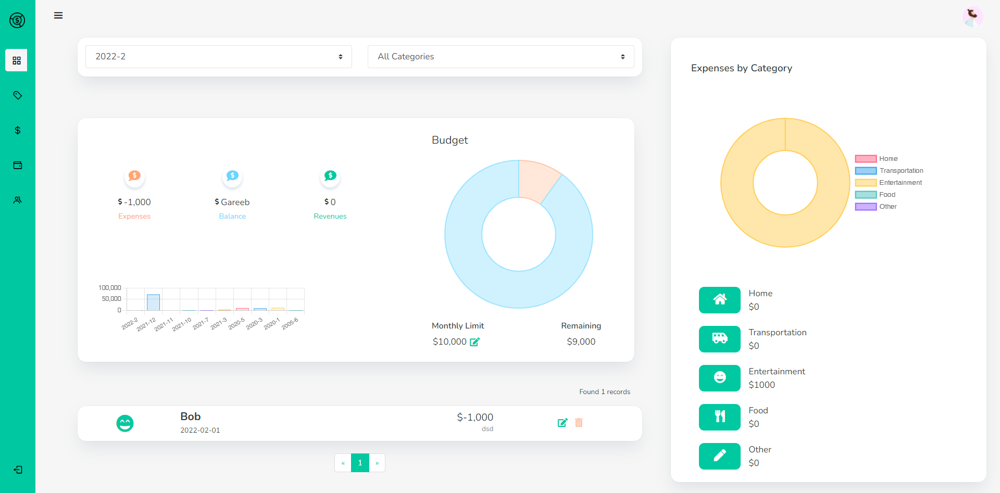

   
  
  <h1>💸 Expense Tracker 💸</h1>
  <strong>Lets Make Tracking Our Money Easy</strong>
    
    

This project just includes the frontend part of the website

# Spendee

The aim of this project was to organise and keep track of expenses and incoming money within an small organisation or for personal purpose.

  

### `npm start`

Runs the app in the development mode.\
Open [http://localhost:3000](http://localhost:3000) to view it in your browser.

The page will reload when you make changes.\
You may also see any lint errors in the console.

  

<b>Made with ❤ by Saksham Gupta</b>

